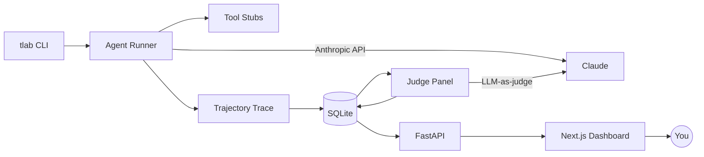

# TrajectoryLab

> Trajectory-level evaluation for tool-using LLM agents.

Most agent projects ship with a `examples/` folder and a vibe check. Production agents need real signal: was the right tool called? in the right order? did the output satisfy a domain-specific rubric? did v2 break a case v1 passed? TrajectoryLab gives you all three with ~one config file per benchmark.

## What it does

Instead of grading only the final answer, TrajectoryLab captures the **full agent trajectory** — system prompt, tool calls, tool results, reasoning steps, retries, and final response — then runs a configurable panel of **judges** over both the trajectory and the output. Results land in SQLite and surface through a Next.js dashboard so you can compare agent versions, drill into individual runs, and catch regressions as you iterate.

## What works now (M1)

- `tlab` Python package installable via `uv sync`; sub-packages stubbed: `runner`, `bench`, `judges`, `api`, `storage`
- `tlab/cli.py` — Typer app with `run` and `serve` commands wired to the entry point (`tlab --help` works)
- `web/` — Next.js 14 App Router skeleton that compiles cleanly (`npm run build` passes)
- GitHub Actions CI: ruff lint + format check on every push/PR; Next.js build check in parallel
- `pyproject.toml` with full runtime dependency list (anthropic, fastapi, sqlmodel, typer, pydantic, pyyaml, httpx), ruff config (E, F, I, UP, line-length 88), hatchling build backend
- MIT license, `.gitignore`, `uv.lock`

All end-to-end features (agent runner, judges, storage, dashboard) are implemented in M2–M6.

## Target demo flow

1. `uv run tlab run --benchmark benchmarks/research --agent agents/research_v1.yaml` — runs 10 cases, streams progress.
2. Open the dashboard at `localhost:3000`. The new run appears with aggregate scores (rubric mean, tool-precision, pass rate).
3. Click a failing case — see the trajectory timeline (system → tool call → tool result → assistant), each judge's verdict with rationale, token + latency stats.
4. Edit `agents/research_v1.yaml` → save as `research_v2.yaml`, re-run.
5. Open the **Compare** view, pick v1 vs v2 — see per-case score deltas, regressions highlighted in red, improvements in green.

## Architecture



## Repo layout

```
trajectory-lab/
  tlab/              # python package
    runner/          # agent loop, trace capture         (M2)
    judges/          # rubric, trajectory, output judges  (M4)
    bench/           # yaml loader                        (M3)
    api/             # fastapi app                        (M5)
    storage/         # sqlmodel models, migrations        (M5)
    cli.py           # tlab CLI entry point
  web/               # next.js dashboard                  (M6)
  benchmarks/        # sample benchmark suites            (M3)
  agents/            # sample agent configs               (M2)
  docs/              # screenshots, architecture, demo gif
```

## Quick start

```bash
# Backend
uv sync
uv run tlab --help

# Frontend
cd web
npm install
npm run dev       # http://localhost:3000
```

## Judges (planned, M4)

| Judge | Type | What it checks |
|---|---|---|
| `RubricJudge` | LLM-as-judge | YAML rubric: criteria, weights, pass thresholds |
| `TrajectoryJudge` | Deterministic | expected tool called, max steps, no error loops |
| `OutputJudge` | Deterministic | exact-match / regex / JSON-schema validators |

## Status

| Milestone | Status |
|---|---|
| M1 — scaffold + readme | ✅ done |
| M2 — agent runner + trace | 🔲 planned |
| M3 — benchmark loader | 🔲 planned |
| M4 — judge panel | 🔲 planned |
| M5 — FastAPI + SQLite | 🔲 planned |
| M6 — Next.js dashboard | 🔲 planned |

## License

MIT — see [LICENSE](LICENSE).
