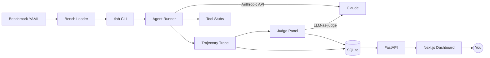

# TrajectoryLab

> Trajectory-level evaluation for tool-using LLM agents.

Most agent projects ship with a `examples/` folder and a vibe check. Production agents need real signal: was the right tool called? in the right order? did the output satisfy a domain-specific rubric? did v2 break a case v1 passed? TrajectoryLab gives you all three with ~one config file per benchmark.

## What it does

Instead of grading only the final answer, TrajectoryLab captures the **full agent trajectory** — system prompt, tool calls, tool results, reasoning steps, retries, and final response — then runs a configurable panel of **judges** over both the trajectory and the output. Results land in SQLite and surface through a Next.js dashboard so you can compare agent versions, drill into individual runs, and catch regressions as you iterate.

## What works now (M6)

- `tlab` Python package installable via `uv sync`
- **`tlab/runner/`** — fully implemented agent loop (M2):
  - `trace.py`: `Trajectory`, `Step`, `ToolCall`, `ToolResult` Pydantic v2 models capturing every step (messages, tool calls, tool results, latency, token counts)
  - `tools.py`: `web_search` and `calculator` mock tools + `TOOL_DEFINITIONS` / `DEFAULT_HANDLERS`
  - `loop.py`: `run_agent()` — synchronous Anthropic-SDK agent loop with configurable `max_steps`, injectable client for testing
- **`tlab/bench/`** — benchmark loader (M3):
  - `schema.py`: `Benchmark`, `BenchCase`, `AgentConfig`, `Rubric`, `RubricCriterion`, `OutputValidator` Pydantic v2 models
  - `loader.py`: `load_benchmark(path)` and `load_agent(path)` — validates YAML against schema, raises `FileNotFoundError` / `ValidationError` on bad input
- **`tlab/judges/`** — judge panel (M4):
  - `schema.py`: `JudgeVerdict` and `CriterionGrade` Pydantic v2 models
  - `output.py`: `OutputJudge` — deterministic `exact_match` / `regex` / `json_schema` validators against `final_response`
  - `trajectory.py`: `TrajectoryJudge` — checks expected tools were called, step count within `max_steps`, and no 3-consecutive-error loop occurred
  - `rubric.py`: `RubricJudge` — calls Claude via forced `grade_rubric` tool use; returns weighted criterion scores; injectable client for testing
- **`tlab/storage/`** — SQLite persistence layer (M5):
  - `models.py`: six SQLModel tables — `Agent`, `Benchmark`, `Run`, `CaseResult`, `TrajectoryRecord`, `Verdict`
  - `engine.py`: `get_engine()` singleton (reads `TLAB_DB` env var, defaults to `~/.tlab/tlab.db`); `get_session()` for FastAPI `Depends`; `reset_engine()` for test isolation
  - `crud.py`: `upsert_agent`, `upsert_benchmark`, `create_run`, `save_case_result`, `finalize_run`, `list_*`, `get_*` helpers
- **`tlab/api/`** — FastAPI service (M5):
  - Six REST endpoints: `GET /runs`, `GET /runs/{id}`, `GET /runs/{id}/cases/{case_id}`, `GET /agents`, `GET /benchmarks`, `GET /compare?a=&b=`
  - CORS middleware enabled for Next.js dev server
  - OpenAPI docs at `/docs`, ReDoc at `/redoc`
- **`tlab/cli.py`** — `tlab run` fully wired end-to-end: loads benchmark + agent, loops over cases, runs all three judges, persists to SQLite, prints pass/fail per case + final summary; `tlab serve` starts uvicorn
- **`benchmarks/`** — two reference benchmark suites (M3): `research/` (10 cases) and `calculator/` (10 cases)
- **`agents/`** — two sample agent configs (M3): `research_v1.yaml`, `calculator_v1.yaml`
- `tests/`: 54 pytest tests total (M2–M5); no live API key required
- **`web/`** — Next.js 14 App Router dashboard, Tailwind CSS (M6):
  - `src/lib/types.ts` — TypeScript interfaces mirroring all Pydantic schemas and trace models
  - `src/lib/api.ts` — typed fetch helpers (`getRuns`, `getRun`, `getCase`); base URL from `NEXT_PUBLIC_API_URL` (defaults to `http://localhost:8000`)
  - `/runs` — runs table with pass rate bar, mean score badge, cases column
  - `/runs/[id]` — run header (agent, model, benchmark, date, aggregate stats) + case card grid with score badges
  - `/runs/[id]/cases/[caseId]` — full trajectory timeline (system → user → assistant/tool calls → tool results → final) + three-judge panel with per-criterion rationale + token/latency badges
  - `ScoreBadge`, `StatBadges`, `TrajectoryTimeline`, `JudgePanel` — shared server components; `<details>`/`<summary>` for collapsible blocks (no client JS needed)
  - All pages use `export const dynamic = 'force-dynamic'` so `npm run build` succeeds without a running API
- GitHub Actions CI: ruff lint + format check on every push/PR; Next.js build check in parallel

## Target demo flow

1. `uv run tlab run --benchmark benchmarks/research --agent agents/research_v1.yaml` — runs 10 cases, streams progress.
2. Open the dashboard at `localhost:3000`. The new run appears with aggregate scores (rubric mean, tool-precision, pass rate).
3. Click a failing case — see the trajectory timeline (system → tool call → tool result → assistant), each judge's verdict with rationale, token + latency stats.
4. Edit `agents/research_v1.yaml` → save as `research_v2.yaml`, re-run.
5. Open the **Compare** view, pick v1 vs v2 — see per-case score deltas, regressions highlighted in red, improvements in green.

## Architecture



## Repo layout

```
trajectory-lab/
  tlab/              # python package
    runner/          # agent loop, trace capture         (M2 ✓)
    bench/           # yaml loader                        (M3 ✓)
    judges/          # rubric, trajectory, output judges  (M4 ✓)
    api/             # fastapi app                        (M5 ✓)
    storage/         # sqlmodel models, crud              (M5 ✓)
    cli.py           # tlab CLI entry point
  tests/             # pytest suite (54 tests, no API key required) (M5 ✓)
  web/               # next.js dashboard                  (M6 ✓)
  benchmarks/        # sample benchmark suites            (M3 ✓)
  agents/            # sample agent configs               (M3 ✓)
  docs/              # screenshots, architecture, demo gif
```

## Quick start

```bash
# Backend
uv sync
uv run pytest            # 54 tests, no API key required
uv run tlab --help

# Run a benchmark (requires ANTHROPIC_API_KEY)
uv run tlab run --benchmark benchmarks/research --agent agents/research_v1.yaml
uv run tlab run --benchmark benchmarks/calculator --agent agents/calculator_v1.yaml

# Start the API server
uv run tlab serve        # http://localhost:8000 — OpenAPI docs at /docs

# Frontend
cd web
npm install
npm run dev       # http://localhost:3000
```

## Judges

| Judge | Type | What it checks |
|---|---|---|
| `RubricJudge` | LLM-as-judge | YAML rubric: criteria, weights, pass thresholds |
| `TrajectoryJudge` | Deterministic | expected tools called, step count within `max_steps`, no 3-consecutive error loops |
| `OutputJudge` | Deterministic | `exact_match` / `regex` / `json_schema` validators |

All judges accept `(trajectory: Trajectory, case: BenchCase) → JudgeVerdict`. `RubricJudge` uses forced tool use (`grade_rubric`) so grades are structured JSON, not free text. The client is injectable — no API key needed in tests.

## Status

| Milestone | Status |
|---|---|
| M1 — scaffold + readme | ✅ done |
| M2 — agent runner + trace | ✅ done |
| M3 — benchmark loader | ✅ done |
| M4 — judge panel | ✅ done |
| M5 — FastAPI + SQLite | ✅ done |
| M6 — Next.js dashboard | ✅ done |

## License

MIT — see [LICENSE](LICENSE).
